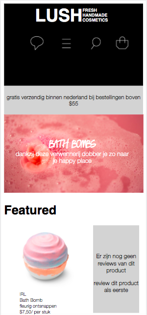
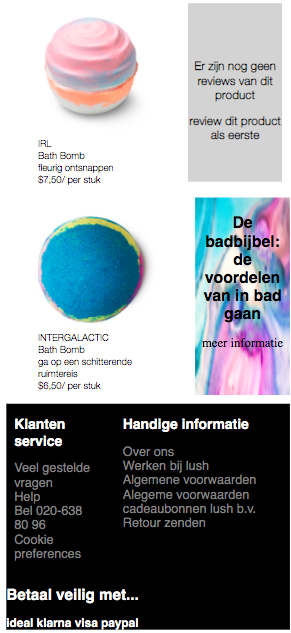
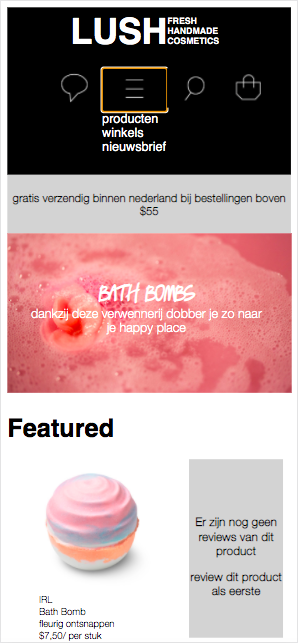
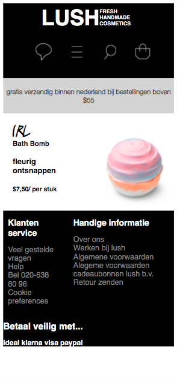
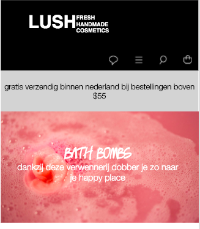
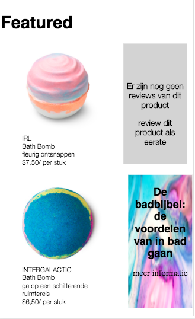

# Procesverslag
**Auteur:** -Francine van Wechem-

Markdown cheat cheet: [Hulp bij het schrijven van Markdown](https://github.com/adam-p/markdown-here/wiki/Markdown-Cheatsheet). Nb. de standaardstructuur en de spartaanse opmaak zijn helemaal prima. Het gaat om de inhoud van je procesverslag. Besteedt de tijd voor pracht en praal aan je website.

## Bronnenlijst

1. https://nl.lush.com/products/bath-bombs
2. https://freefontsdownload.net/free-helveticaneue-font-74318.htm
3. https://www.dafont.com/lush.font
4. https://issuu.com/aysekahraman8/docs/lush_20finished_20final
5. https://www.google.com/search?q=lush+sex+bomb&sxsrf=ALeKk03corbliF8oWUyZ4_r0It6LrB2tCQ:1599924131988&source=lnms&tbm=isch&sa=X&ved=2ahUKEwiv1rfs9ePrAhWMC-wKHSuFBNgQ_AUoAXoECAwQAw&biw=921&bih=720#imgrc=uy_rYMIMKTq6eM
6. http://www.wonderlushie.com/2018/11/review-lush-intergalactic-bath-bomb.html
7. https://pngriver.com/download-visa-logo-png-image-98671/
8. https://freebiesupply.com/logos/ideal-logo/
9. https://www.rvwebsolutions.nl/webdevelopment/koppelingen/klarna

## Eindgesprek (week 7/8)

-Aan het begin moest ik weer een beetje inkomen met het hele coderen. Ik moest de meest gebruikte tags weer een beetje voor mezelf terug halen. Alle opdrachtjes van de les hebben mij heel erg geholpen. Ben vaak daar naar terug gegaan om te bekijken hoe iets werkt. De meeste moeilijkheden zaten hem in de javascript bij mij (waar ik hieronder nog wat over gezegd heb). Heb wel weer veel van deze opdracht geleerd. Ben zelf redelijk tevreden met mijn resultaat als ik kijk naar hoe weinig ervaring ik eigenlijk nog heb. Heb minder dan een jaar geleden pas voor het eerst html en css gebruikt. -

**Screenshot(s):**

## De laatste weken (javascript)

-Ben eindelijk aan mijn javascript begonnen en dat ging mij nog al moeilijk af. Ik heb veel naar de opdrachten gekeken die we voor de les moesten doen maar heb ook op het internet gezocht. Ik heb meerdere dingen geprobeerd ookal was het soms lastig omdat ik de uitwerking die ik op internet vond niet goed snapte. Uiteindelijk had ik via een van de opdrachten wel een oplossing bedacht maar wist ik niet zo goed hoe ik het moest gaan uitvoeren. Ik wist dat ik iets met toggle en iets met visibility hidden moest doen om het menu te laten verdwijen en te voorschijn te laten komen. Ik had het eerst zelf geprobeerd maar heb daarna klasgenootjes om hulp gevraagd en die hebben mij gelukkig kunnen helpen. (ik was in elk geval wel al goed op weg). JavaScript vond ik zeker weten het moeilijkste en meest frustrerende deel, puur omdat ik het nog niet zo goed begrijp. Mijn kennis van het vak programmeren was alweer een beetje weg gevaagd... -

## Voortgang 3 (week 6)

-Heb mijn tweede pagina voor het grootste deel af. Heb gewerkt aan de footer. Dat was wel nog een beetje een klusje om alle tekst goed naast elkaar te krijgen maar het was uiteindelijk gelukt. Ook heb ik de tweede pagina nu wel goed kunnen verbinden met de eerste pagina. Ik was steeds aan het werken met < link > terwijl ik natuurlijk < a > moest gebruiken. -

## Voortgang 2 (week 5)

### Stand van zaken
-Ik ben deze keer want minder ver gekomen dan de vorige keer maar heb wel een aantal dingen kunnen fixen die eerst niet goed waren gegaan. De menubalk bestaat nu wel uit apartje icoontjes en heb ze netjes naast elkaar gekregen. Ook klopt het Lush logo aan de bovenkant nu goed. Ben al een beetje aan mijn tweede pagina begonnen maar nog niet heel erg. Ik merk dat het werken met display flex oa steeds makkelijker gaat omdat ik het veel gebruik. Door de herhaling onthoud ik het allemaal goed. Moet soms wel terug kijken in mijn code hoe iets ook al weer ging maar ik vind gelukkig alles makkelijk terug.-

## Voortgang 1 (week 3)

### Stand van zaken

-Ik heb nog best wel wat moeite met html/css dus liep bij redelijk wat puntjes lang vast, waardoor ik ook erg lang met dit kleine stukje van de website bezig ben geweest. Ben uiteindelijk wel tevreden met wat ik nu voor elkaar heb gekregen aangezien mij het nog best wat moeite gekost heeft. Ik snap nu ook wel een aantal dingen beter dan voorheen, wat fijn is. Had vooral moeten met de afbeeldingen en teksten (de verschillende sections) naast erlkaar te krijgen. Maar heb genoeg hulp aan medeleerlingen gervaagd (en aan mensen buiten school) en dat heeft zeker geholpen. -

**Screenshot(s):**

### Agenda voor meeting

-we willen vragen stellen over: de navigatie bar, microinteracties en over responsive maken.-

### Verslag van meeting

- >de menubar icoontjes apart doen >het logo netjes krijgen met display flex -

## Intake (week 1)

**Je startniveau:** -blauw-

**Je focus:** -surface plane-

**Je opdracht:** -https://nl.lush.com -

**Screenshot(s):**

**Breakdown-schets(en):**

